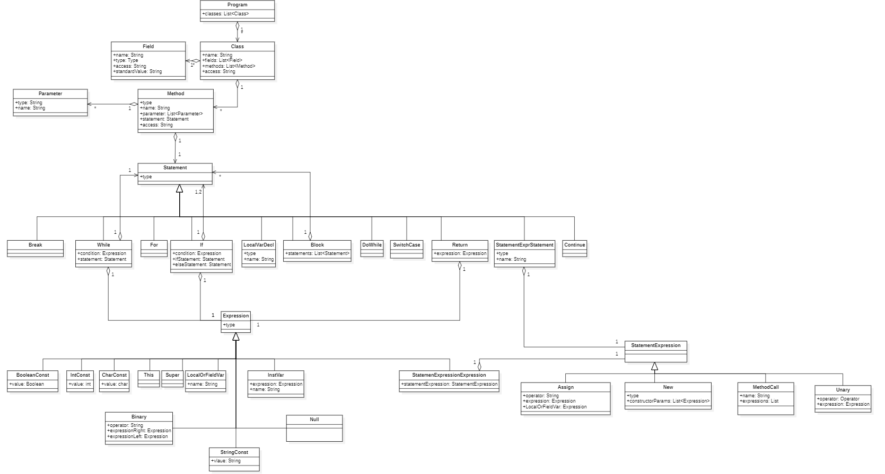

# Flompiler

Im Rahmen der Vorlesung "Compilerbau" an der DHBW Stuttgart Campus Horb entwickeln wir als Gruppe den minimalen Java-Compiler "Flompiler".

## Gruppenzusammenstellung

| Name            | Aufgabenbereich | Benutzername | Dokumentation                   |
|-----------------|-----------------|--------------|---------------------------------|
| Ruben Kraft     | Parser          | Pereki       | [Parser](docs/parser.md)        |
| Lukas Burkhardt | Typ-Check       | L4kiLuk      | [Type-check](docs/typecheck.md) |
| Paul Lehmann    | Bytecode        | NoName11234  | [Bytecode](docs/bytecode.md)    |
| David Maier     | Tests           | dasdawidt    | [Tests](docs/tests.md)          |

## Aufbau des Compilers

Unser Compiler besteht aus drei Teilen:

* Dem [`ScannerParserLexer`](src/main/java/de/flyndre/flompiler/scannerparserlexer/ScannerParserLexer.java), der die Input-Datei einliest, sie in Tokens umwandelt und parst.
    So entsteht der ungetypte abstrakte Syntaxbaum.
* Dem [`TypeChecker`](src/main/java/de/flyndre/flompiler/typecheker/TypeChecker.java), der die Semantik der Tokens kontrolliert, woraus der getypte abstrakte Syntaxbaum resultiert.
* Dem [`BytecodeGenerator`](src/main/java/de/flyndre/flompiler/bytecodegenerator/BytecodeGenerator.java), der aus dem resultierenden getypten abstrakten Syntaxbaum Bytecode generiert.

Orchestriert wird der Compiler von [`Flompiler`](src/main/java/de/flyndre/flompiler/Flompiler.java), der als Controller fungiert und zwischen den Komponenten vermittelt.
Dieser implementiert eine Main-Methode, die den Pfad zur Input-Datei als erstes Argument erhält.

Die drei Bestandteile kommunizieren intern den abstrakten Syntaxbaum (AST), der wie folgt aufgebaut ist:



## Unterstütze Features

Es folgt eine Übersicht über die prägnantesten der unterstützen Features.

### Datentypen

* `boolean`
* `int`
* `char`
* `String`

### Operatoren

* Arithmetische (`+`, `-`, `*`, `/`)
* Logische (`&&`, `||`)
* Unäre (`++`, `--`)

### Klassen

* Klassen an sich
* Konstruktoren
* Methoden

### Strukturen

* `if`, `if-else`
* `while`, `do-while`
* `for`

## Verwendung

Der Flompiler erwartet beim Start ein Kommandozeilenargument, welches den Pfad zur zu kompillierenden `.java`-Datei angibt.
Wird der (kompilierte) Compiler in der Kommandozeile verwendet, startet man den Kompilierungsprozess mit:

```sh
java Flompiler "path/to/file.java"
```

Alternativ kann der Pfad in der IDE als Kommandozeilenargument angegeben werden.
Beispiel-Quelldateien befinden sich im Ordner [`src/test/resources`](src/test/resources/).
Bei erfolgreicher Kompilierung erzeugt der Compiler eine gleichnamige `.class`-Datei neben der Input-Datei.
